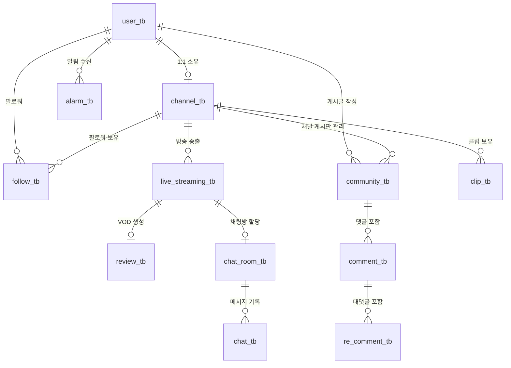

지금까지 논의한 **스트리밍 라이브 플랫폼 프로젝트**의 기초 설계 내용을 프로젝트 문서(README.md 또는 DESIGN.md)로 바로 사용할 수 있도록 **Markdown 형식**으로 정리해 드립니다.

이 내용을 복사해서 `.md` 파일로 저장하거나 노션에 붙여넣으시면 됩니다.

---

# 📺 스트리밍 라이브 플랫폼 프로젝트 기초 설계서

## 1. 프로젝트 개요

* **목적**: 실시간 스트리밍, 커뮤니티 소통, 숏폼(클립) 홍보 기능을 갖춘 통합 라이브 플랫폼 구축.
* **핵심 타겟**: 스트리머와 시청자 간의 긴밀한 상호작용 및 채널 성장을 돕는 커뮤니티 환경 제공.

---

## 2. 주요 비즈니스 로직

### 계정 및 권한 승격 프로세스

1. **회원가입**: 일반 유저(`USER`)로 가입 (OAuth2 또는 일반 가입).
2. **이메일 인증**: `is_verified` 컬럼을 통해 인증 여부 확인.
3. **채널 생성**: 이메일 인증이 완료된 유저만 본인의 채널을 생성 가능.
4. **권한 승격**: 채널 생성 성공 시 유저의 Role이 `USER` → `STREAMER`로 자동 승격.
5. **관리**: 스트리머는 본인 채널의 게시물 CRUD 및 방송 송출 권한을 가짐.

---

## 3. 데이터베이스 설계 (ERD)

### 📊 Entity Relationship Diagram

---

## 4. 테이블 상세 명세

### 👤 4.1 회원 및 채널 (Account)

| 테이블 | 컬럼 | 설명 | 비고 |
| --- | --- | --- | --- |
| **user_tb** | `user_id(PK)`, `email`, `password`, `nickname`, `role`, `is_verified`, `oauth_provider`, `oauth_id` | 사용자 기본 정보 | Role: USER, STREAMER, ADMIN |
| **channel_tb** | `channel_id(PK)`, `user_id(FK)`, `channel_name`, `description`, `stream_key`, `follower_count` | 스트리머 개인 방송 공간 | 1유저 1채널 |

### 📹 4.2 미디어 및 스트리밍 (Media)

| 테이블 | 컬럼 | 설명 | 비고 |
| --- | --- | --- | --- |
| **live_streaming_tb** | `stream_id(PK)`, `channel_id(FK)`, `title`, `category`, `viewer_count`, `status` | 현재 라이브 정보 | Status: ON, OFF |
| **review_tb** | `review_id(PK)`, `stream_id(FK)`, `video_url`, `duration`, `view_count` | 종료된 방송 다시보기(VOD) |  |
| **clip_tb** | `clip_id(PK)`, `channel_id(FK)`, `title`, `video_url`, `view_count` | 숏츠 및 홍보용 클립 |  |

### 📝 4.3 소셜 및 커뮤니티 (Social)

| 테이블 | 컬럼 | 설명 | 비고 |
| --- | --- | --- | --- |
| **follow_tb** | `follow_id(PK)`, `user_id(FK)`, `channel_id(FK)` | 유저의 채널 구독 정보 |  |
| **community_tb** | `post_id(PK)`, `channel_id(FK)`, `user_id(FK)`, `title`, `content`, `share_count` | 채널 내 공지 및 게시글 |  |
| **comment_tb** | `comment_id(PK)`, `post_id(FK)`, `user_id(FK)`, `content` | 게시물 댓글 |  |
| **re_comment_tb** | `re_id(PK)`, `comment_id(FK)`, `user_id(FK)`, `content` | 댓글의 댓글 |  |
| **alarm_tb** | `alarm_id(PK)`, `user_id(FK)`, `type`, `message`, `is_read` | 활동 알림 |  |

### 💬 4.4 채팅 (Chat)

| 테이블 | 컬럼 | 설명 | 비고 |
| --- | --- | --- | --- |
| **chat_room_tb** | `room_id(PK)`, `stream_id(FK)` | 실시간 채팅방 | 방송 세션당 1개 |
| **chat_tb** | `chat_id(PK)`, `room_id(FK)`, `user_id(FK)`, `message`, `sent_at` | 채팅 메시지 로그 |  |

---

## 5. 향후 확장 고려 사항

* **성능 최적화**: 채팅 데이터의 경우 트래픽이 몰릴 시 Redis 또는 NoSQL로 전환 고려.
* **실시간성**: 시청자 수 업데이트 시 DB 직접 부하를 줄이기 위해 캐싱 전략 활용.
* **VOD 처리**: 방송 종료 후 자동 인코딩 및 S3 업로드 파이프라인 구축.

---
